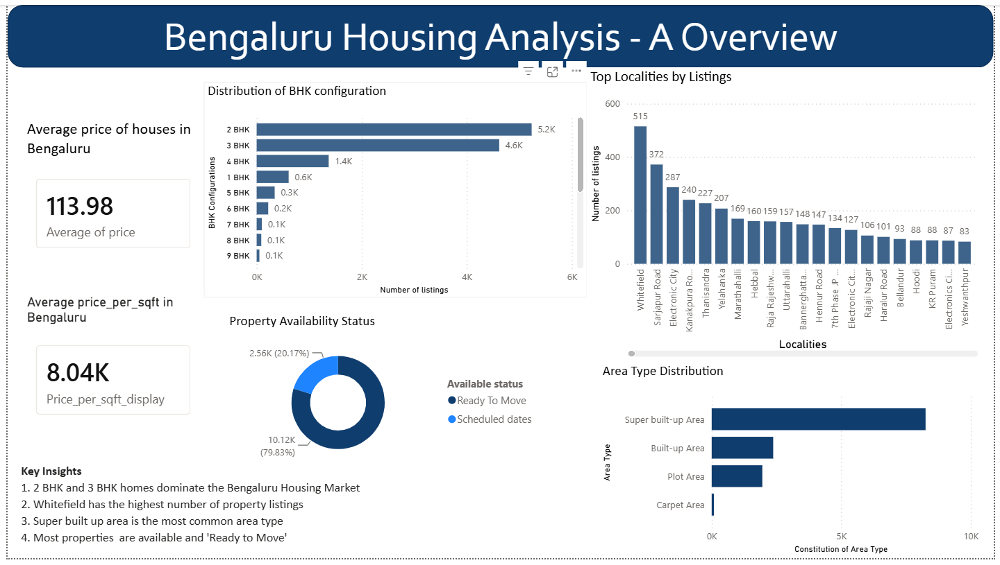

# Bengaluru-Housing-Analysis
An end to end data analytics project analyzing the Bengaluru Housing Market using Excel, Mysql and  PowerBI

# Introduction
Buying a house in Bengaluru is one of the major urban challenges in 2026 due to various reasons like- 
1. High property rates - Especially in developed/premium localities in Bengaluru the cost is expected to be around 9200 to 12000+ per sq ft
2. Dead segment - Houses below the price of 50 lakh make up only 6% of the Housing market
3. Luxury soaring - All the major projects in Bengaluru offer premium houses/flats starting from around 1.5CR onwards
4. No space - With the increase in the population in Bengaluru, finding a plot or even a studio apartment is challenging due to no space availabilities

Fun fact:- House prices in Bengaluru has jumped by 25% in just one year .
           Bengaluru is now the second most expensive city to buy a home in India, right after Mumbai
           
This project aims to answer the following business question:

# *Which Bengaluru localities provide the best balance of affordability, availability, property configuration, and value for young professionals and first-time home buyers?*

#  Dataset
This project uses a cleaned Bengaluru Housing dataset containing approximately 13,000 property listings with 9 features. The dataset includes important information such as property location, area type, availability, BHK configuration, total square footage, number of bathrooms, balconies, and property price.

To support a more meaningful analysis, an additional feature, *Price per Square Foot*, was calculated and used throughout the project to compare property values across different localities. 
This dataset provides a comprehensive view of Bengaluru's housing market and serves as the foundation for analyzing affordability, availability, and housing trends for young professionals and first-time home buyers.

#  Tools Used

- Microsoft Excel
- MySQL
- Power BI
- GitHub

  #  Data Cleaning

The dataset was cleaned using Microsoft Excel before performing analysis.
The cleaning process included:
- Removed duplicate records
- Handled missing values
- Removed unnecessary columns
- Standardized property price and total square footage values
- Created *Available Status* and *Available Month* columns
- Calculated *Price per Square Foot*

# SQL Analysis

Business questions explored during exploratory data analysis include:

1. Which Bengaluru localities offer the best value based on *average price per square foot* for 2 BHK and 3 BHK homes?
2. How are property prices distributed across Bengaluru, and which localities have the highest concentration of homes within the *₹40–80 lakh* budget suitable for first-time buyers?
3. Which Bengaluru localities provide the *highest square footage per rupee*, offering the best value for money?
4. Which localities offer the *most spacious 2 BHK homes relative to their average price*, making them attractive for budget-conscious buyers?
5. Among properties with *Scheduled Possession*, what is the average waiting period, and which localities have the longest expected possession times?
6. What is the *most common BHK configuration* in each locality, and which localities are dominated by 1 BHK, 2 BHK, or 3 BHK homes?
7. How does the *number of balconies* influence the average price per square foot, and are buyers paying a premium for additional balconies?
8. How does the *area type* (Super Built-up, Built-up, Carpet Area, and Plot Area) influence the average price per square foot?
9. Which Bengaluru localities have an *above-average price per square foot*, indicating premium or luxury housing markets?
10. Which Bengaluru localities provide the *best overall balance of affordability, availability, and housing configuration* for young professionals and first-time home buyers?

The complete SQL queries and analysis can be found in:
📄 [Housing analysis eda - SQL.sql](Housing%20analysis%20eda%20-%20SQL.sql)

 # Power BI Dashboard
The dashboard consists of *three interactive pages*:
#  Dashboard Overview
Provides an overview of Bengaluru's housing market including:

- Average house price
- Average price per square foot
- BHK distribution
- Top localities by listings
- Area type distribution
- Property availability

# Affordability and Value
Focuses on comparing affordability across Bengaluru using:
- Budget slicer
- Average property prices
- Price per square foot
- Locality comparison
- Area type comparison

# Readiness and Size Configuration
Provides insights into:
- Ready-to-Move vs Scheduled properties
- BHK-wise locality distribution
- Balcony analysis
- Property availability across localities

The dashboard consists of three interactive pages:- 
# Dashboard Overview

# Affordability & Value

# Readiness & Size Configuration

# Skills Demonstrated
- Data Cleaning
- Exploratory Data Analysis (EDA)
- SQL
- Data Visualization
- Dashboard Design
- Business Problem Solving
- Data Storytelling

# Repository Structure

Bengaluru-Housing-Analysis
│
├── Bengaluru_House_Cleaned_Dataset.xlsx
├── Original_Bengaluru_House_Dataset.xlsx
├── Housing analysis eda - SQL.sql
├── Bengaluru Housing Dashboard.pbix
├── README.md
│
└── Dashboard_Screenshots
    ├── Overview.png
    ├── Affordability and Value.png
    └── Readiness and Size configuration.png

# 🎯 Conclusion

This project demonstrates the complete workflow of a data analytics project—from data cleaning and SQL-based exploratory analysis to building an interactive Power BI dashboard. The insights generated can help first-time home buyers and young professionals compare localities based on affordability, availability, and property characteristics, enabling more informed housing decisions.
